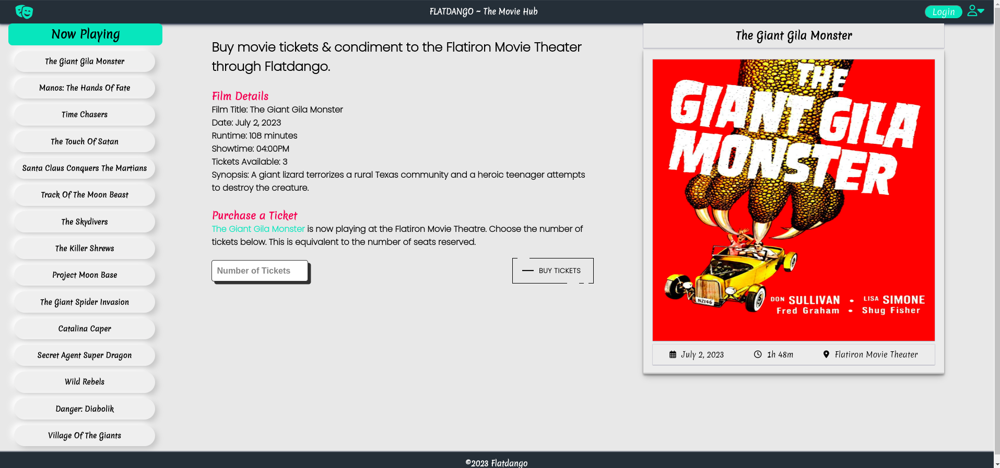

# Phase 1 : Week 3 Code Challenge

[](https://opensource.org/licenses/MIT)
[](https://www.javascript.com)

## Flatdango: A Mini Web App

## Introduction

This is a code challenge for Phase 1 Week 3 whose aim is implementing a 'mini' web application using `JavaScript`.

This challenge involves building out an application, Flatdango, that allows a user to purchase movie tickets from the Flatiron Movie Theater. I will use a local API and build out a simple front-end for the app.

Below is an image of the mini web app:



## Project Setup

### View the web app via GH Pages

Use this link to directly open the web app deployed via GitHub Pages.

NB: This doesn't require you to set up the local server.

```
https://arshavineroy.github.io/phase-1-week-3-code-challenge/
```

#### How to use the app

- Pick a film on the list and view its details
- Enter the desired number of tickets in the input field
- Click the `Buy Tickets` button to purchase
- If the number of tickets entered exceed the available tickets or the capacity required, an error message is shown to the user.
- When a movie is sold out, the purchase button should display `Sold Out`
- (Admin) There is a `ticket reset` button that appears if tickets are depleted to set available tickets to max.

#### Alternatively,

### 1. Clone the repository

```
git clone https://github.com/ArshavineRoy/phase-1-week-3-code-challenge
```

### 2. Navigate to the project directory

```
cd phase-1-week-3-code-challenge
```

### 3. Install and start JSON server

Install the JSON server

```
npm install -g json-server
```

Start JSON Server

```
json-server --watch db.json
```

- **Note:** Running this command will instruct `json-server` to use the `db.json` file in the terminal's current directory, so make sure to run this command from the same directory as this project.

Test the server by visiting this route in the browser

```
http://localhost:3000/films
```

### Several ways to launch the app

### 4.1. Launch the app using its HTML file

Open `index.html` on your browser, preferably Chrome.

### 4.2. Launch the app using Visual Studio Code

Navigate to the repo directory in the `terminal`, and type `code .` to open the project in VS Code.

- Alternatively, run VS Code and open the project repo folder directly.

### 4.2.2. Install Live Server extension

Open `Extensions` in VS Code `(Ctrl+Shift+X)`, search for `Live Server` by `Ritwick Dey`, and click `Install`.

Open `index.html` and right-click anywehre within the file and select `Open with Live Server` from the context menu.

This will automatically launch a local development server and open the mini app in your default web browser.

## Core Deliverables for this Challenge

A user should be able to:

1. See the first movie's details, including its poster, title, runtime, showtime, and available tickets when the page loads. The number of available tickets will need to be derived by subtracting the number of `tickets_sold` from the theater's `capacity`. A GET request is made to the following endpoint to retrieve the film data:

```js
$ GET /films/1
```

Example Response:

```json
{
  "id": "1",
  "title": "The Giant Gila Monster",
  "runtime": "108",
  "capacity": 30,
  "showtime": "04:00PM",
  "tickets_sold": 27,
  "description": "A giant lizard terrorizes a rural Texas community and a heroic teenager attempts to destroy the creature.",
  "poster": "https://www.gstatic.com/tv/thumb/v22vodart/2157/p2157_v_v8_ab.jpg"
}
```

2. See a menu of all movies on the left side of the page in the `ul#films` element when the page loads. (_optional_: you can style each film in the list by adding the classes `film item` to each `li` element.) There is a placeholder `li` in the `ul#films` element that is hardcoded in the HTML — feel free to remove that element by editing the HTML file directly, or use JavaScript to remove the placeholder element before populating the list. You will need to make a GET request to the following endpoint to retrieve the film data:

```js
$ GET /films
```

Example Response:

```json
[
  {
    "id": "1",
    "title": "The Giant Gila Monster",
    "runtime": "108",
    "capacity": 30,
    "showtime": "04:00PM",
    "tickets_sold": 27,
    "description": "A giant lizard terrorizes a rural Texas community and a heroic teenager attempts to destroy the creature.",
    "poster": "https://www.gstatic.com/tv/thumb/v22vodart/2157/p2157_v_v8_ab.jpg"
  },
  {
    "id": "2",
    "title": "Manos: The Hands Of Fate",
    "runtime": "118",
    "capacity": 50,
    "showtime": "06:45PM",
    "tickets_sold": 44,
    "description": "A family gets lost on the road and stumbles upon a hidden, underground, devil-worshiping cult led by the fearsome Master and his servant Torgo.",
    "poster": "https://www.gstatic.com/tv/thumb/v22vodart/47781/p47781_v_v8_ac.jpg"
  }
]
```

3. Buy a ticket for a movie. After clicking the "Buy Ticket" button, I should see the number of available tickets decreasing on the frontend. I should not be able to buy a ticket if the showing is sold out (if there are 0 tickets available). **No persistence is needed for this feature**.

## Bonus Deliverables

1. Click on a movie in the menu to replace the currently displayed movie's details with the new movie's details. Note that you may have to make an additional GET request to access the movie's details.

2. When a movie is sold out (when there are no available tickets remaining), indicate that the movie is sold out by changing the button text to "Sold Out". Also update the film item in the `ul#films` menu by adding a class of `sold-out` to the film. For reference, here's what the contents of the `ul#films` element should look like with a sold out film:

```html
<li class="film item">(Title of film)</li>
<li class="sold-out film item">(Title of a sold-out film)</li>
<li class="film item">(Title of film)</div>
```

## Extra Bonus

These extra bonus deliverables involve using `fetch` to update data on the `json-server` backend by using `POST`, `PATCH`, and `DELETE` requests.

1. When a ticket is purchased, persist the updated number of `tickets_sold` on the server. Remember, the frontend shows the number of available tickets based on the `tickets_sold` and the `capacity`, so only the `tickets_sold` should be updated on the backend when a ticket is purchased. You will need to make a request that follows this structure:

```txt
   PATCH /films/:id

   Request Headers: {
     Content-Type: application/json
   }

   Request Body: {
     "tickets_sold": 28
   }
   ----
   Example Response:
   {
      "id": "1",
      "title": "The Giant Gila Monster",
      "runtime": "108",
      "capacity": 30,
      "showtime": "04:00PM",
      "tickets_sold": 28,
      "description": "A giant lizard terrorizes a rural Texas community and a heroic teenager attempts to destroy the creature.",
      "poster": "https://www.gstatic.com/tv/thumb/v22vodart/2157/p2157_v_v8_ab.jpg"
   }
```

2. Delete a film from the server. Add a delete button next to each film in the `ul#films` menu. When the button is clicked, remove the film from the list and also delete the film on the server:

```txt
   DELETE /films/:id

   Example Response:
   {}
```

## Author & License

Authored by [Arshavine Waema](https://github.com/ArshavineRoy).

Licensed under the [MIT License](LICENSE) - see the [LICENSE](LICENSE) file for details.
